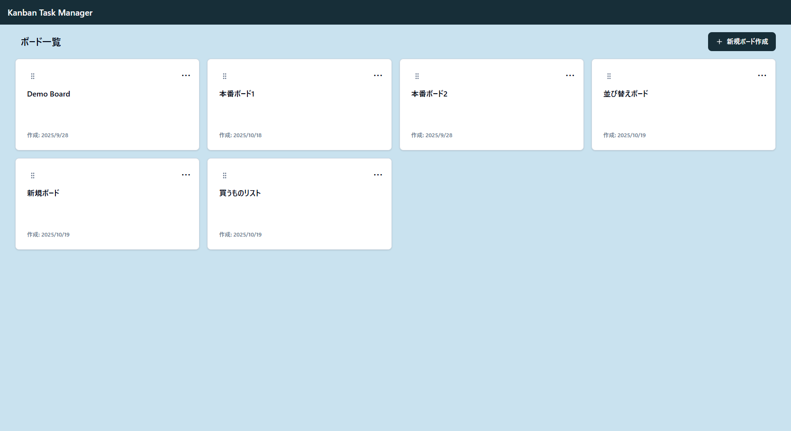
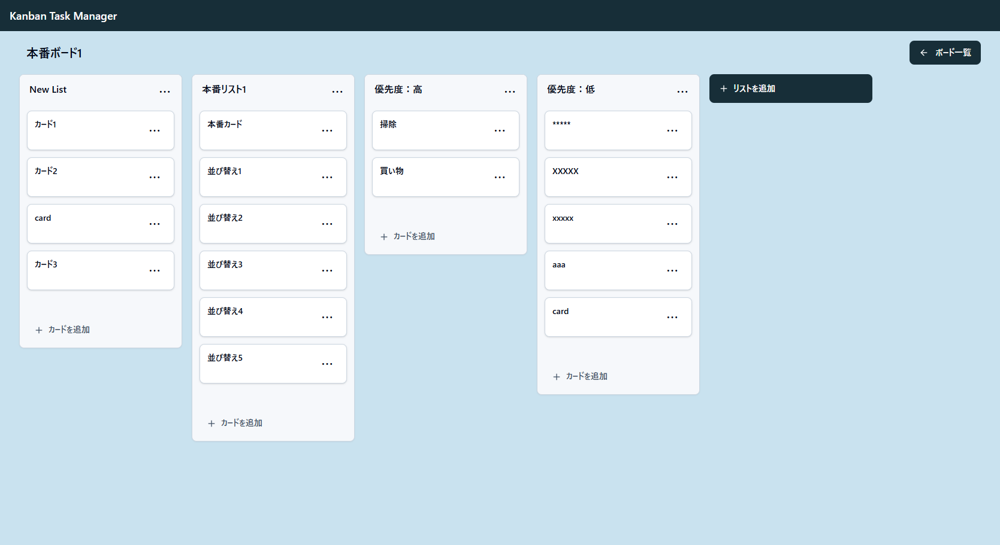
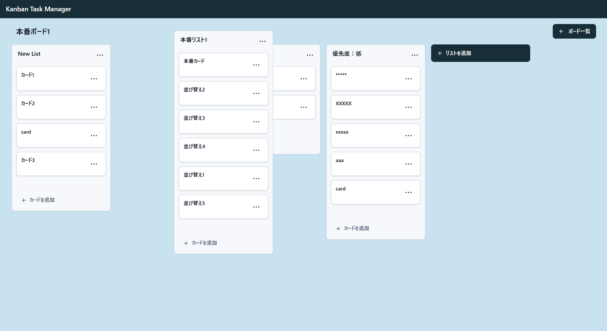

# Kanban Task Manager

<p>
  <a href="https://kanban-task-manager-seiya.vercel.app/">
    
  </a>
</p>

<p>
  
  
  
  
  
</p>

ボード / リスト / カード で構成されたシンプルなカンバンボードです。  
**認証なしで自由編集**（CRUD操作 と並び替えが誰でも可能）にしています。

## デモ

公開URL：https://kanban-task-manager-seiya.vercel.app/

[](https://kanban-task-manager-seiya.vercel.app/)

## スクリーンショット

<table>
  <tr>
    <td>
      
    </td>
  </tr>
  <tr>
    <td>
      
    </td>
  </tr>
  <tr>
    <td>
      
    </td>
  </tr>
  <tr>
    <td>
      
    </td>
  </tr>
</table>

## 特徴

- **ボード一覧**
  - 新規ボード作成 / 3 点メニューから **名称編集・削除**
  - ボードの**並び替え**
- **ボード詳細**
  - **リスト**と**カード**の CRUD
  - リストの並び替え（**横並び替え**）
  - カードの並び替え（**縦並び替え**、**他リストへ移動**）
  - 新規ボードは **空のリスト 1 つを自動作成**（カードは 0）
  - **リスト追加=一番右の右隣** / **カード追加=各リスト最下部**
- **ボード / リスト / カード の上限値**
  - ボード数：15 / 1ボード内のリスト数：8 / 1ボード内のカード数：40

## 使い方

1. `/boards` で **新規ボード作成**
2. ボードを開く → リスト追加 → カード追加
3. リスト・カードは **ドラッグ＆ドロップ**で並び替え/移動が可能

## 画面構成

- **ボード一覧**：グリッド表示（カード型）、右上にから「新規ボード作成」ボタン
- **ボード詳細**：
  - ヘッダーにボード名、右上に「ボード一覧」ボタン
  - 横並びでリスト、各リスト内にカードが配置
  - 一番右のリストの右隣りに「リストを追加」ボタン
  - 各リストの最下部に「カードを追加」ボタン

## ディレクトリ構成

```bash
prisma/
  schema.prisma
  migrations/*
  seed.(ts|mjs)               # 初期データ
src/
  app/
    boards/
      page.tsx                # ボード一覧ページ
      _components/
        BoardsGrid.tsx        # 一覧のグリッド表示
        CreateBoardDialog.tsx # ボード追加
      [id]/
        page.tsx              # ボード詳細ページ
        _components/
          BoardView.tsx       # 詳細のメイン
          AddListColumn.tsx   # リスト追加
          AddCardRow.tsx      # カード追加
          EditControls.tsx    # 3点メニューの編集操作
          QuickCreate.tsx     # 追加操作
    actions/*                 # Server Actions
  components/ui/*             # shadcn/ui
  hooks/
    use-toast.ts
```

## 技術スタック

- **Next.js (App Router) + TypeScript**
- **Tailwind CSS 3**
- **Prisma**（Vercel Postgres）
- @dnd-kit/core + @dnd-kit/sortable
- Zustand

## セットアップ

### 1) 依存インストール

```bash
npm i
```

### 2) 環境変数

```bash
PRISMA_DATABASE_URL="prisma+postgres://..."
DATABASE_URL="postgres://..."
```

### 3) DB 初期化 & Seed

```bash
npx prisma migrate dev
npx prisma db seed
```

### 4) 起動

```bash
npm run dev
```

## セキュリティ / 注意

- 認証認可の機能は実装していないため、共通の画面（データ）を誰でも編集可能になっています。
